[English](/README.md) | [Русский](/README.ru_RU.md)

# Monitoring Synology NAS with SNMP and Grafana

<table>
  <tr>
    <td>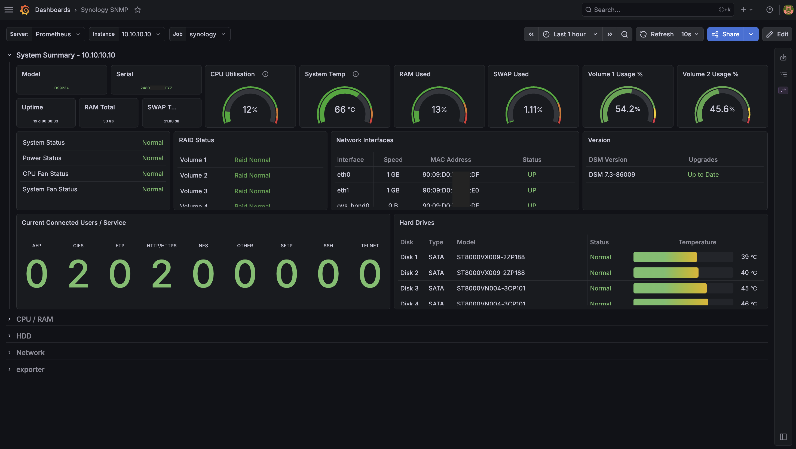</td>
    <td>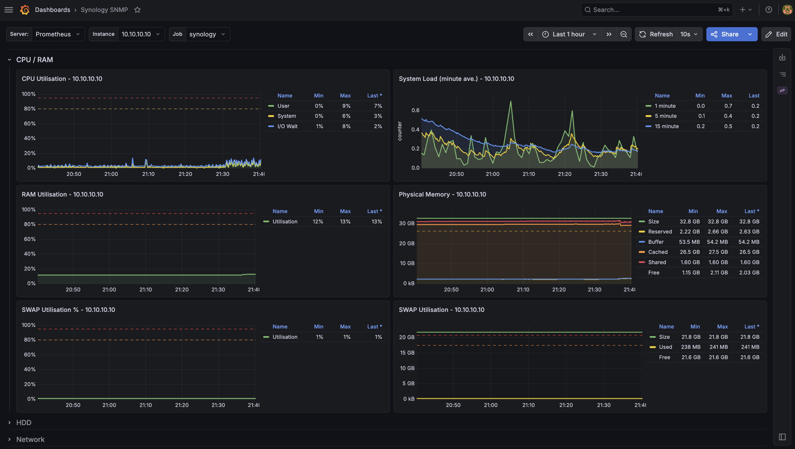</td>
  </tr>
  <tr>
    <td>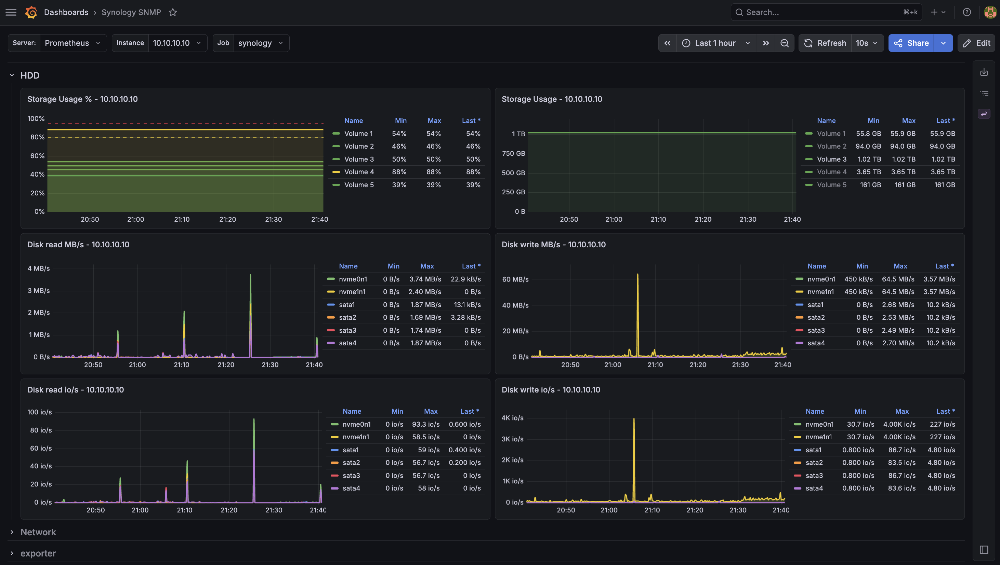</td>
    <td>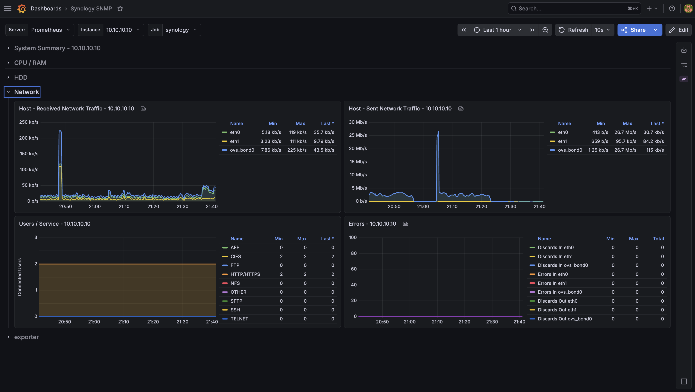</td>
  </tr>
</table>

## Description

Setting up Synology NAS monitoring to display NAS status metrics in a Grafana dashboard.

How it works:
- The SNMP service is running on the NAS
- SNMP Exporter requests SNMP metrics
- Prometheus collects and stores metrics gathered by SNMP Exporter
- Grafana renders dashboards based on metrics stored in Prometheus

```
┌╌╌╌╌╌┐       ┌╌╌╌╌╌╌╌╌╌╌╌╌╌┐       ┌╌╌╌╌╌╌╌╌╌╌╌╌┐       ┌╌╌╌╌╌╌╌╌╌┐
┆ NAS ┆ - - > ┆SNMP EXPORTER┆ - - > ┆ PROMETHEUS ┆ - - > ┆ GRAFANA ┆
└╌╌╌╌╌┘       └╌╌╌╌╌╌╌╌╌╌╌╌╌┘       └╌╌╌╌╌╌╌╌╌╌╌╌┘       └╌╌╌╌╌╌╌╌╌┘
```

## Installation

### Installation Steps
 - enable the SNMP service
 - download the project
 - edit the configuration files
 - upload the project to the NAS
 - run the project in Portainer or Container Manager

### 1. Enabling the SNMP Service
To collect metrics, you must enable the SNMP service on your Synology NAS.
This can be done via `Control Panel` => `Terminal & SNMP` => `SNMP` => `Community: synology`

<details>
  <summary>SNMP</summary>
  <table>
  <tr>
    <td>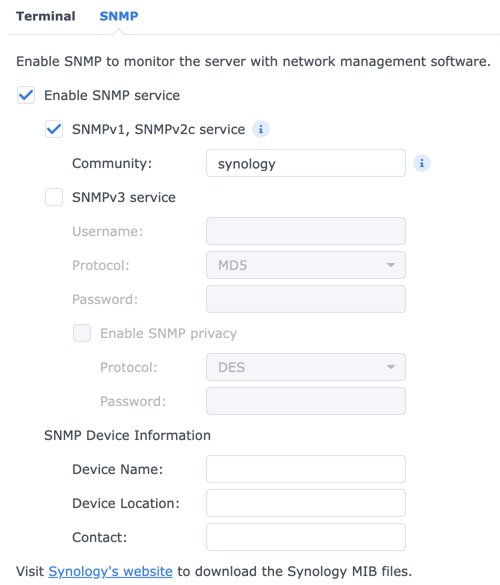</td>
  </tr>
</table>
</details>

### 2. Cloning the repository to your PC
   
### 3. Editing the configuration files
- `.env`
  - BASE_PATH project directory in Synology File Station
  - GF_ADMIN_USER and GF_ADMIN_PASSWORD grafana username and its password

- `prometheus/prometheus.yml` 
  - set the current IP address of the NAS
    `- targets: [ "10.10.10.10" ] # IP address of Synology NAS`

### 4. Uploading the edited project to the Synology NAS

Using File Station create a directory named `synology-snmp-monitoring` in the `docker` directory. \
Upload the project contents to the created directory. \
You can simply drag and drop the folder into your browser window or use SFTP client.

<details>
  <summary>Folder</summary>
  <table>
  <tr>
    <td>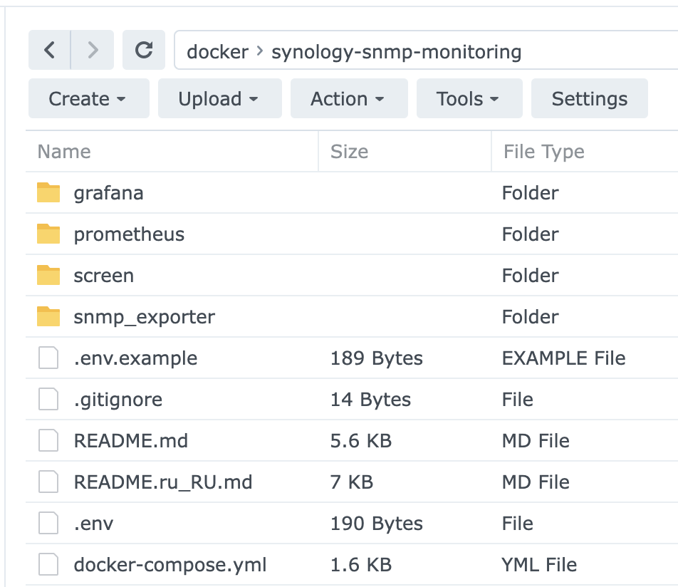</td>
  </tr>
</table>
</details>

### 5. Creating the Project (Stack)

We will look at two options for configuring the stack:
- using Portainer (preferred option)
- using the standard Synology Container Manager

#### Using Portainer (preferred option)

> [!TIP]
> Compared to Container Manager, using Portainer provides broader options for container management.
> For example, volume management is available in Portainer, which is missing in Container Manager.

##### Installing Portainer

Create a directory named `portainer` inside the `docker` directory using File Station. \
In Container Manager, select `Project` => `Create`
- Project name `portainer`
- Path `docker/portainer`
- Source `Create docker-compose.yml`

Paste the following configuration and run the project

<details>
<summary>docker-compose.yml</summary>

```yaml
services:
    portainer:
        image: portainer/portainer-ce
        container_name: portainer
        restart: unless-stopped
        ports:
            - "8000:8000"
            - "9000:9000"
        volumes:
            - "/var/run/docker.sock:/var/run/docker.sock"
            - "/volume1/docker/portainer:/data"
```

</details>

##### Deploying the Stack

Log in to Portainer at `http://<synology-ip>:9000`
- go to `Stacks`
- `Add stack` 
- `Name` enter the name for the new stack `synology-snmp-monitoring` 
- `Build method` select `Web editor`
- paste the contents of the project's `docker-compose.yml`
- `Environment variables` click `Advanced mode`
- paste the contents of the project's `.env` file
- `Deploy the stack`

Upon successful completion of the stack deployment, you will have three running containers.

<details>
  <summary>Stack</summary>
  <table>
  <tr>
    <td>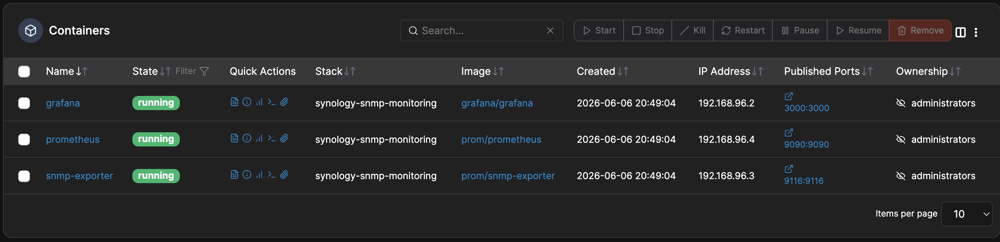</td>
  </tr>
</table>
</details>

#### Using Synology Container Manager

In Container Manager, select `Project` => `Create`
- Project name `synology-snmp-monitoring`
- Path `docker/synology-snmp-monitoring`
- Select `Use existing an docker-compose.yml to create the project` 

Upon successful completion of the stack deployment, you will have three running containers.

<details>
  <summary>Project</summary>
  <table>
  <tr>
    <td>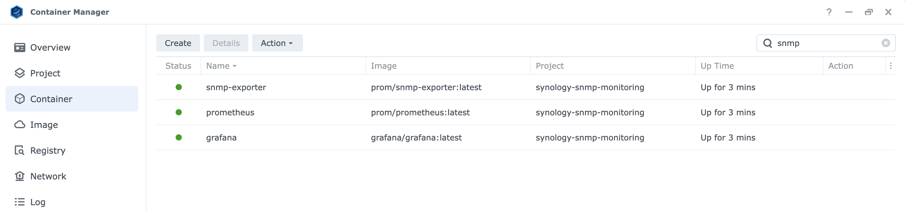</td>
  </tr>
</table>
</details>

### 6. Addresses of the Deployed Services
- snmp-exporter `http://<synology-ip>:9116/snmp?target=<synology-ip>&auth=synology&module=synology`
- prometheus `http://<synology-ip>:9090`
- grafana `http://<synology-ip>:3000`

### 7. Dashboard
Log in to Grafana, the Synology SNMP dashboard will be available in the sidebar menu under the Dashboards tab

## Additionally

> [!IMPORTANT]
> The following must be pre-configured on your Synology NAS:
>  - DDNS service
>  - setup for [wildcard certificates](https://mariushosting.com/synology-how-to-add-wildcard-certificate/)

To make Grafana accessible via the domain name `https://grafana.<your-synology-ddns>.synology.me` add a reverse proxy rule.

`Control Panel` => `Login Portal` => `Advanced` => `Reverse Proxy` => `Create`

<details>
  <summary>Reverse Proxy</summary>
  <table>
  <tr>
    <td>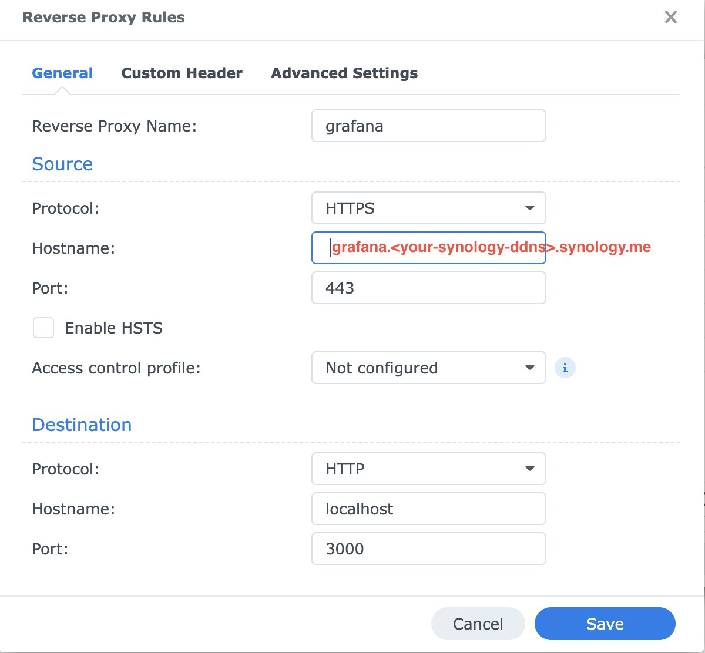</td>
    <td>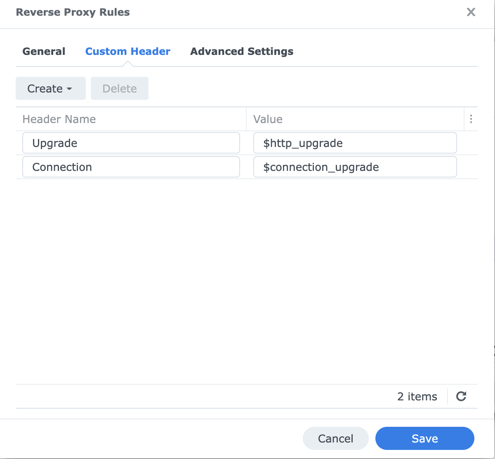</td>
    <td>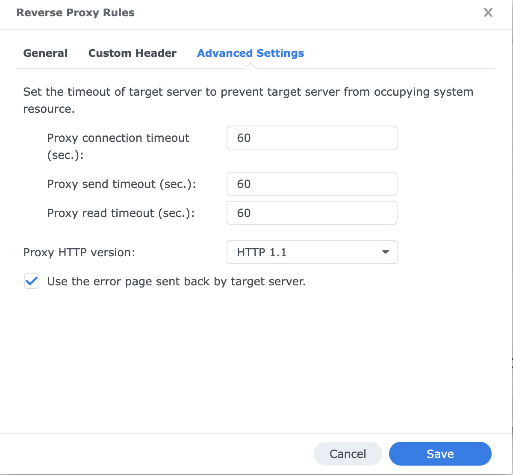</td>
  </tr>
  </table>
</details>